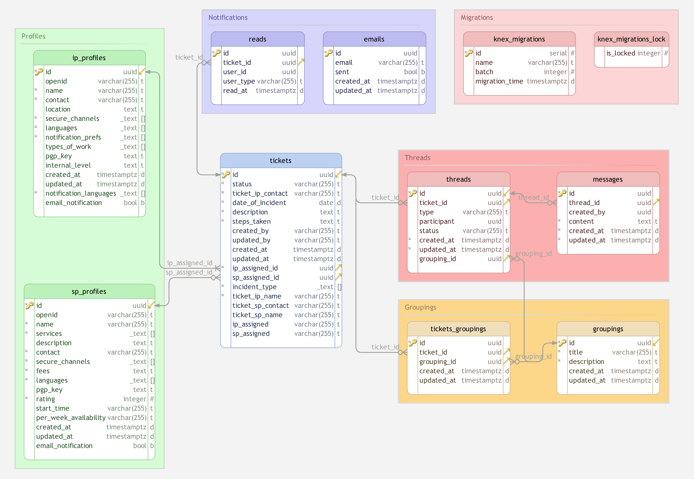

## 🏡 Architecture

### 🗺 Overview

The system is composed of:

 - ExpressJS API that serves data over REST
 - Postgres Database for storage
 - Authentication and authorization using JSON Web Tokens

### 📦 Database


### 🙅 Authentication

Authentication with the API is done by sending an `Authorization` header containing a valid [JWT](https://jwt.io). The API checks the JWT signature using the environment variable `JWT_SECRET`. For more information, you can read the documentation of [express-jwt](https://github.com/auth0/express-jwt).

### 👮 Authorization

A valid JWT should encode a `roles` array that contains the type of user that is accessing the resource. The array items can be one of `Admin`, `IP` or `SP`. An admin has access to all resources, `IP` and `SP` only have access to certain routes and certain database columns. This is enforced as route middleware in `lib.js` for every route, and using the rules in `permissions/*`.

The profile of a user is tied to the JWT `sub` field, and the profile of the user is retrieved by matching `sub` to the `openid` field in either the `ip_profiles` or `sp_profiles` DB table. Admin users do not have profiles.

### 🔔 Notifications

Certain types of database transactions are logged in the `reads` table so that we can notify users of future changes.
Requests to the following routes will write to this table with `ticket_id`, `user_type`, and `user_id`:

- `/tickets/*`
- `/threads/:thread_id/messages` (recorded as a read of the parent ticket)

The `ticket` objects returned from `/tickets` and `/tickets/:id` contain a property `notify` which is created with the following logic:

- If a relevant entry is found on the read table (matches ticket id and user information):
  - If the ticket has been updated since the last read `notify: true`
  - If any of the threads that the user can read have been updated since the last read `notify: true`
  - Otherwise, `notify: false`  
- If no entry is found, `notify: true`

### ✉️ Email

Pending email transactions are created for the following actions:

- IP
  - Ticket status changes
  - New comments in a thread
- SP
  - Ticket status changes
  - New comments in a thread
  - Assigned to a ticket
- Admin
  - When a new ticket is created
  - Updates to IP/SP Profiles

These pending transactions are stored in the DB table `emails`. On a schedule, we run `clock.js` which creates one email per unique address in the pending records. These emails are queued and sent via [Mailgun](https://www.mailgun.com/).

### ✨Logs

Logging is configurable via the `LOG_DIRECTORY` environment variable. There are four daily rotated log files:

- `yyyy-mm-dd-api-info-log`: Info level logs for the API. Contains access logs as well as which `openid` made the request. Each request is assigned a unique ID. The request is logged as "id", "response time" followed by the [Apache Combined Log Format](https://github.com/expressjs/morgan#combined)
- `yyyy-mm-dd-api-error-log`: Errors from the API
- `yyyy-mm-dd-mailer-info-log`: Info level logs from the mailer process
- `yyyy-mm-dd-mailer-error-log`: Errors from the mailer process

```
Sample log output for API access

2017-05-22T21:20:33.138Z - info: 49d2294b-8323-47df-9fce-3451b37b905a - Requested by Admin
2017-05-22T21:20:33.876Z - info: 49d2294b-8323-47df-9fce-3451b37b905a 743.227 ms - ::1 - - [22/May/2017:21:20:33 +0000] "GET /tickets HTTP/1.1" 304 - "http://localhost:3000/" "Mozilla/5.0 (Macintosh; Intel Mac OS X 10_12_4) AppleWebKit/537.36 (KHTML, like Gecko) Chrome/58.0.3029.110 Safari/537.36"

2017-05-22T21:21:53.961Z - info: d977b3e0-34ff-4e1f-ac42-ba6b22268ea3- Requested by auth0|58cb0f6412697c67a1d475b3
2017-05-22T21:21:53.964Z - info: d977b3e0-34ff-4e1f-ac42-ba6b22268ea3 49.087 ms - ::1 - - [22/May/2017:21:21:53 +0000] "GET /profile HTTP/1.1" 200 408 "http://localhost:3000/" "Mozilla/5.0 (Macintosh; Intel Mac OS X 10_12_4) AppleWebKit/537.36 (KHTML, like Gecko) Chrome/58.0.3029.110 Safari/537.36"

```
